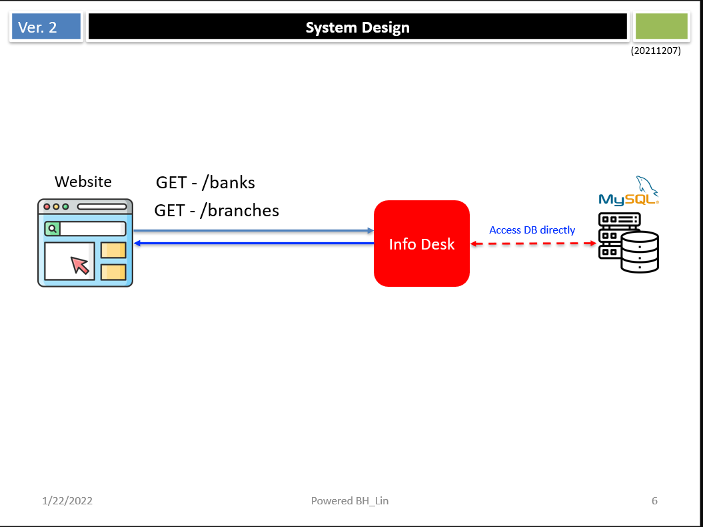

  
Info Desk  
================================================

The purpose of this project is to get a list of banks

## Table of Contents

<!-- START doctoc generated TOC please keep comment here to allow auto update -->
<!-- DON'T EDIT THIS SECTION, INSTEAD RE-RUN doctoc TO UPDATE -->
- [Info Desk](#info-desk)
  - [Table of Contents](#table-of-contents)
  - [The Design](#the-design)
  - [On Server Side](#on-server-side)
    - [Prepare your Go Environment](#prepare-your-go-environment)
    - [Start Back-End Server](#start-back-end-server)
  - [On Front-End Side](#on-front-end-side)
    - [Start Web Server to Interact with Back-End Server](#start-web-server-to-interact-with-back-end-server)
  - [Test on Website](#test-on-website)
  - [How to Run Test Cases.](#how-to-run-test-cases)
  - [How to Use CLI for Testing](#how-to-use-cli-for-testing)
  - [Use Docker to Start the Server](#use-docker-to-start-the-server)
  - [How to build image](#how-to-build-image)
<!-- END doctoc generated TOC please keep comment here to allow auto update -->

## The Design



if you want to build and run the server locally, here is the user guide.  

## On Server Side
### Prepare your Go Environment
Download and Install 
<https://go.dev/doc/install>

### Start Back-End Server 
start the go server and listen the port 9090

```shell
go run main.go
```

Here is the APIs provided by Server


There are two tables related to the task.  


## On Front-End Side 
### Start Web Server to Interact with Back-End Server
you can use your favorite http-server.   
(in this case, I use this <https://formulae.brew.sh/formula/http-server>)
```shell
cd website4testing; 
http-server --cors;
```

After launching the web server, you can visit the website.   


Once you have chosen the bank, you can filter by province and city.  
And then, you can see the result.  


## Test on Website


## How to Run Test Cases. 
```shell
go test -v ./
```


## How to Use CLI for Testing
* Command to get a list of banks that support withdrawals
```shell
curl --location --request GET 'http://127.0.0.1:9090/banks'
```

* Command to list bank branches by conditions
```shell
curl --location --request GET 'http://127.0.0.1:9090/branches?city=深圳市&bankcode=104&province=广东省'
```


## Use Docker to Start the Server
Input following command in the root folder. Then, visit the website "http://localhost:9091"
```shell
docker-compose up -d
```


## How to build image 

,